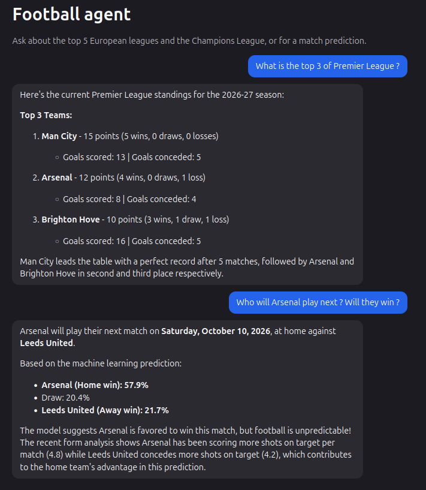
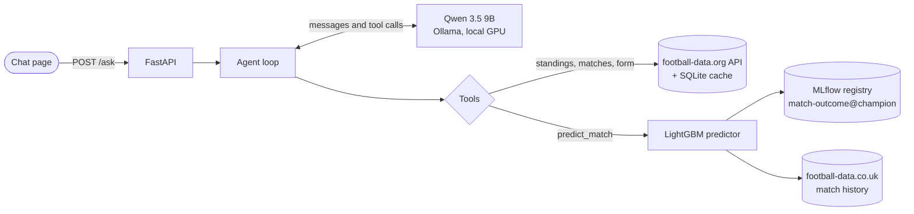

# football-match-analyst

[](https://github.com/alexandrebertot/football-match-analyst/actions/workflows/ci.yml)

An LLM agent that answers questions about the top 5 European leagues and the Champions League by
calling tools: live data from the [football-data.org](https://www.football-data.org) API and a
LightGBM match outcome predictor. The LLM runs locally: Qwen 3.5 9B served by Ollama on a laptop
GPU (RTX 4060, 8 GB).



## How it works



The agent sends the question and the tools' JSON schemas to the LLM, runs the tool calls it asks
for and sends the results back, until the LLM answers in text. Tool errors, such as an unknown team
name, go back to the LLM as messages so that it can fix its arguments. The loop is written by hand,
without a framework, so that the exact conversation format is known: it is what the fine-tuning
step will reproduce. Every question is traced in MLflow: each LLM call with its prompt and tokens,
and each tool call with its arguments and result.

| Tool | Returns |
| --- | --- |
| `get_standings` | League table of a competition and season |
| `get_matches` | Matches between two dates: scores of finished ones, status of upcoming ones |
| `get_team_form` | A team's last results: record, points and a form string such as `WWDLW` |
| `predict_match` | Home win, draw and away win probabilities, with the recent form the model used (league matches only) |

## Match predictor

**Data.** Results, shot statistics and closing odds of the top 5 leagues since 2016-17, from
[football-data.co.uk](https://www.football-data.co.uk). There is no such history for the Champions
League, hence no predictions for it.

**Features.** Each team's average over its previous 5 matches: points, shots on target, shots on
target conceded. Each match only sees the matches played before it, and predictions go through the
same feature code as training.

**Split.** By whole seasons, in time order: train on 2016-17 to 2022-23, validate on 2023-24 to
compare configs, test on 2024-25 and 2025-26.

**Results** (log-loss, lower is better):

| Model | Validation, 2023-24 | **Test, 2024-25 and 2025-26** |
| --- | --- | --- |
| Naive: outcome frequencies of the train seasons | 1.0774 | 1.0750 |
| **LightGBM champion, 6 features** | 1.0185 | **1.0285** |
| Bookmakers' closing odds | 0.9533 | 0.9691 |

On the test seasons, scored once after choosing the model, it closes 44% of the gap between the
naive baseline and the closing odds (47% on validation, which was used to choose it). Beating the
odds is not expected: they include team news, injuries and line-ups that match statistics do not.

**Tracking.** Datasets and training runs are described by YAML configs in [`configs/`](configs).
Each run is tracked in MLflow, and the chosen one is registered as the `champion` version of the
`match-outcome` model, which the API loads at start-up.

## Roadmap

- [x] **Agent**: tool calling with football-data.org, FastAPI endpoint
- [x] **Predictor and MLOps**: LightGBM model, MLflow tracking and registry, Docker, CI
- [x] **Chat page**: a local web page to talk with the agent
- [x] **Tracing**: every question recorded in MLflow, with its LLM calls, tool calls and tokens
- [ ] **Follow-up questions**: keep the conversation history, so that "and their next match?" works
- [ ] **Evaluation**: a set of about 50 questions, scored on the right tool, valid arguments and
  exact figures, with results tracked in MLflow
- [ ] **Better agent**: system prompt, tool outputs, thinking mode and model choice, each change
  measured by the evaluation
- [ ] **Fine-tuning**: train a small model with QLoRA on filtered conversations generated by a
  larger model, so that it calls the tools reliably and is cheap to serve
- [ ] **Online demo**: the chat page hosted publicly with the fine-tuned model
- [ ] **Better predictor**: more match statistics (corners, cards), expected goals from another
  source, an Elo rating, hyperparameter tuning with time-based cross-validation, then a final
  score on the held-out test seasons

## Run it

Prerequisites: Python 3.13 with [uv](https://docs.astral.sh/uv/), [Ollama](https://ollama.com),
an NVIDIA GPU with 8 GB of memory, and a free
[football-data.org](https://www.football-data.org) API key.

```bash
uv sync
echo "FOOTBALL_DATA_API_KEY=<your key>" > .env

# The LLM: Qwen 3.5 9B with an 8,192-token context, which keeps it fully on an 8 GB GPU
ollama create football-qwen -f ollama/Modelfile

# The predictor: download the history, build the dataset, train, promote to champion, test
uv run python -m football_agent.predictor.data
uv run python -m football_agent.predictor.prepare --config configs/datasets/last5.yaml
uv run python -m football_agent.predictor.train --config configs/training/plus_shots_on_target_against.yaml
uv run python -m football_agent.predictor.registry --run plus-shots-on-target-against
uv run python -m football_agent.predictor.final_score   # test score, computed once per champion

# The API
uv run --env-file .env uvicorn football_agent.app:app
```

Then open http://localhost:8000 and ask a question. The API can also be called directly:

```bash
curl -X POST http://localhost:8000/ask -H "Content-Type: application/json" \
  -d '{"question": "Who is top of the Premier League?"}'
```

The MLflow UI shows the training runs (experiment `match-outcome`) and the trace of every question
asked to the API (experiment `agent-traces`, Traces tab):
`uv run mlflow ui --backend-store-uri sqlite:///mlflow.db`.

**With Docker**, after the predictor steps above:

```bash
mkdir -p .cache   # so that Docker does not create it as root
docker compose up --build
```

The container uses the host network to reach Ollama, which listens on the host's
`localhost:11434` (tested on Linux).

## Project layout

```
src/football_agent/
  agent.py        # tool-calling loop
  tools.py        # tool functions and their JSON schemas
  data_api.py     # football-data.org client with a SQLite cache
  llm.py          # LLM client (Ollama through the OpenAI-compatible API)
  app.py          # FastAPI app: the chat page and the /ask endpoint
  static/         # the chat page
  predictor/      # data download, features, training, registry, inference
configs/          # dataset and training configs
ollama/Modelfile  # LLM settings
tests/
notebooks/        # data exploration
```

## License

Apache 2.0, see [LICENSE](LICENSE).
